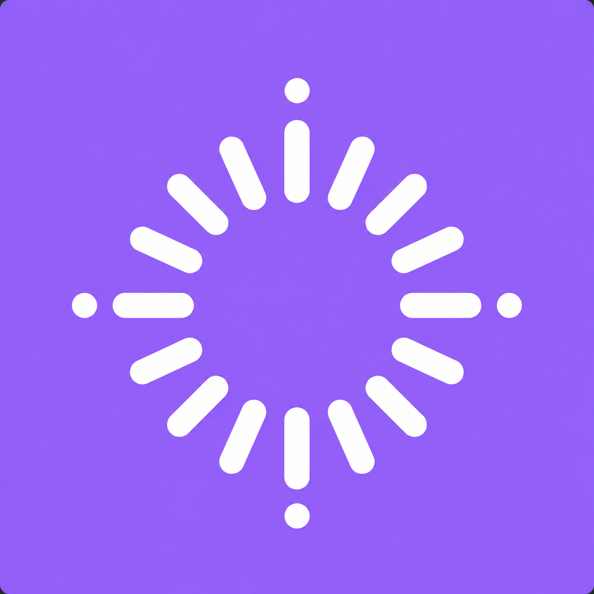
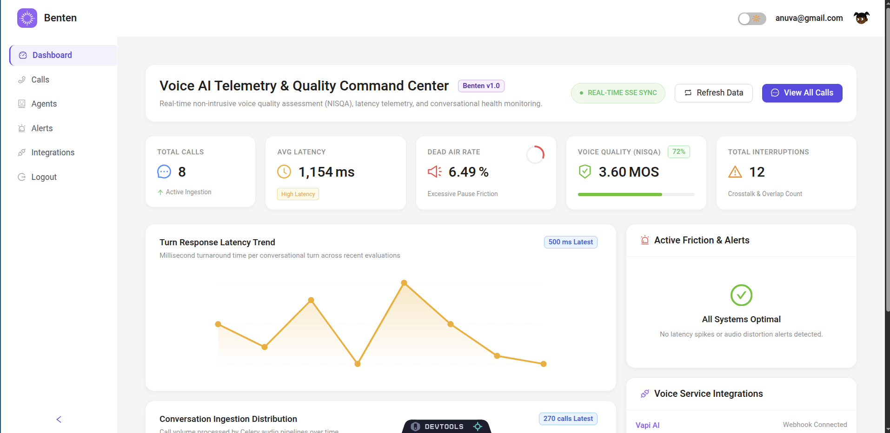
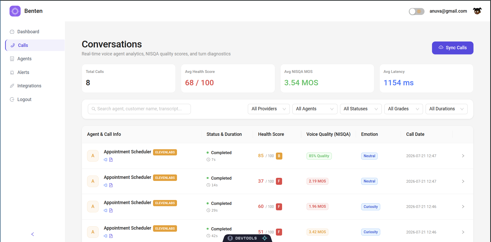
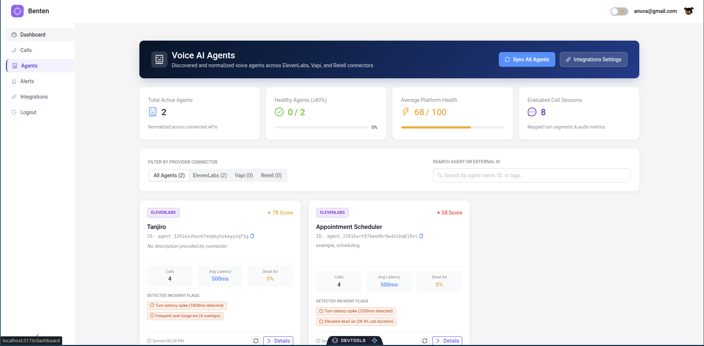
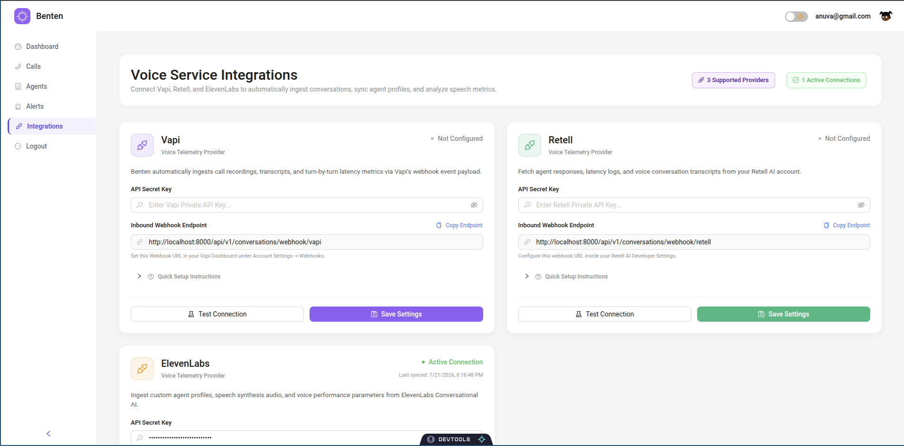

<div align="center">



# Benten

### Voice AI Agents Audio Evaluation & Telemetry Platform

<p align="center">
  Benten is an audio evaluation and analytics platform built specifically for Voice AI agents. It connects directly to voice AI platforms to discover your agents, process call audio, and measure conversation quality, non-intrusive speech quality (NISQA MOS), response latency, and speech dynamics.
</p>

---

</div>

##  Interface Previews

<div align="center">



<p align="center">
  <sub><strong>Telemetry Command Center: Real-time latency tracking, NISQA voice quality, and friction alerts</strong></sub>
</p>

</div>

<br />

<table align="center" style="width: 100%;">
  <tr>
    <td align="center" width="50%">
      <br />
      <sub><strong>Conversations & Detail Drawer</strong></sub>
    </td>
    <td align="center" width="50%">
      <br />
      <sub><strong>Agent Performance & Incidents</strong></sub>
    </td>
  </tr>
  <tr>
    <td align="center" colspan="2">
      <br />
      <sub><strong>Integrations Hub (Vapi, Retell, ElevenLabs, Bolna)</strong></sub>
    </td>
  </tr>
</table>

---

## What is Benten

Unlike standard LLM evaluation tools that only analyze text transcripts, Benten evaluates the complete acoustic and conversational performance of human-to-agent voice calls.

When a customer speaks with a Voice AI agent, Benten measures key acoustic and speech metrics:
- **Turn Latency**: Response delay (in ms) from user speech termination to agent voice playback.
- **Speech Quality (NISQA MOS)**: Deep learning Non-Intrusive Speech Quality Assessment scoring (1.0 to 5.0 MOS).
- **Dead Air Percentage**: Unintended silent pauses during the call session.
- **User Interruptions**: Occurrences where the customer interrupts or speaks over the agent.
- **Health Score**: Calculated conversation quality score (0 to 100) combining acoustic telemetry, sentiment, and flow.

---

## Supported Integrations

Benten integrates directly with leading Voice AI providers. Adding an API key automatically discovers your agents, synchronizes metadata, and prepares them for call evaluation.

<table align="center" style="width: 100%;">
  <tr>
    <td align="center" width="50%">
      <br />
      <strong>ElevenLabs Conversational AI</strong><br />
      <sub>Synchronizes agent profiles via Conversational AI APIs and monitors speech synthesis response times.</sub>
    </td>
    <td align="center" width="50%">
      <br />
      <strong>Vapi AI</strong><br />
      <sub>Discovers Vapi assistants, ingests end-of-call webhooks, and monitors turn latency and dead air.</sub>
    </td>
  </tr>
  <tr>
    <td align="center" width="50%">
      <br />
      <strong>Retell AI</strong><br />
      <sub>Fetches agent profiles and call records, monitoring speech turn overlaps and silence ratios.</sub>
    </td>
    <td align="center" width="50%">
      <br />
      <strong>Bolna AI</strong><br />
      <sub>Fetches agent profiles and execution call logs, parsing structured conversational turns and audio recordings.</sub>
    </td>
  </tr>
</table>

---

## Key Features

- **Automated Agent Discovery**: Enter API keys in the dashboard to automatically sync agents across ElevenLabs, Vapi, Retell, and Bolna.
- **Audio Analysis Pipeline**: Standardizes audio files, detects speech activity with **Silero VAD**, separates speaker turns with **PyAnnote diarization**, scores speech quality using PyTorch **NISQA**, and measures latency, dead air, and interruptions.
- **High-Density Conversations Table**: View all ingested calls with KPI metrics summary bar, consolidated metadata columns, color-coded NISQA MOS tags, and quick re-evaluation controls.
- **3-Pane Call Detail Drawer**: Inspect overall health, turn-by-turn searchable transcripts with seeking audio playback, and technical JSON metadata payloads.
- **Agents Dashboard & Incident Detection**: Track overall health scores, bottleneck incident flags, and raw provider configuration for each voice bot.
- **Integrations Developer Hub**: Manage API secret keys, copy inbound webhook endpoints, verify connections, and trigger manual synchronization.
- **Real-Time Stream Sync**: SSE notification stream pushes updates instantly to frontend dashboards upon evaluation completion.

---

## System Architecture

Benten uses a modular microservices architecture:

- **Frontend (`frontend-benten`)**: React dashboard built with Refine framework, Ant Design components, and React Router.
- **Backend API (`backend`)**: FastAPI application providing user auth, integration key storage, agent management, and dashboard APIs.
- **Task Workers**: Celery workers powered by RabbitMQ for asynchronous audio processing and provider synchronization.
- **Caching and Messaging**: Redis for real-time pub/sub notifications and task cache.
- **Database**: PostgreSQL with Alembic database schema migrations.

---

## Project Structure

```
.
├── assets/                 # Project logo and UI screenshot previews
├── backend/                # FastAPI application, Celery workers, and audio pipeline
│   ├── app/                # Application source code
│   │   ├── api/            # API routers (auth, agents, integrations, dashboard)
│   │   ├── models/         # SQLAlchemy database models
│   │   ├── workers/        # Celery tasks and provider connectors
│   │   └── pipeline/       # Audio analysis and NISQA feature extraction engine
│   ├── migrations/         # Alembic database schema migrations
│   └── requirements.txt    # Python backend dependencies
├── frontend-benten/        # React + Refine dashboard UI
│   ├── src/                # Pages (Agents, Calls, Dashboard, Integrations, Auth)
│   └── package.json        # Frontend Node.js dependencies
├── docker/                 # PostgreSQL, Redis, and RabbitMQ Docker Compose setup
├── start_dev.sh            # One-command development server script
└── README.md               # Project documentation
```

---

## Getting Started

### 1. One-Command Setup

Run the orchestrator script to start all backing services, backend API, Celery worker, and frontend dashboard:

```bash
./start_dev.sh
```

Press `Ctrl+C` to stop all services simultaneously.

### 2. Reset & Fresh Start

To wipe all Docker volumes (database, Redis, RabbitMQ), delete virtual environments and caches, and restart from scratch:

```bash
./fresh_start.sh
```

*(Tip: Pass `./fresh_start.sh --clean-only` to clean without restarting).*

---

### 3. Manual Setup

#### Step 1: Start Backing Infrastructure
```bash
docker compose -f docker/docker-compose.yml up -d
```

#### Step 2: Start Backend Server and Celery Worker
```bash
cd backend
python3 -m venv venv
source venv/bin/activate
pip install -r requirements.txt
cp .env.example .env

# Run database migrations
alembic upgrade head

# Start FastAPI web server
uvicorn app.main:app --reload --port 8000

# Start Celery worker (in a separate terminal)
celery -A app.workers.celery_app worker --loglevel=info
```

#### Step 3: Start Frontend Dashboard
```bash
cd frontend-benten
npm install
npm run dev
```

---

## Application Endpoints

- **Frontend Dashboard**: http://localhost:5173
- **Backend API Docs (Swagger)**: http://localhost:8000/docs
- **RabbitMQ Management Console**: http://localhost:15672 (Username: `benten_mq`, Password: `mq_secure_pwd`)

---

## License

This project is licensed under the MIT License.