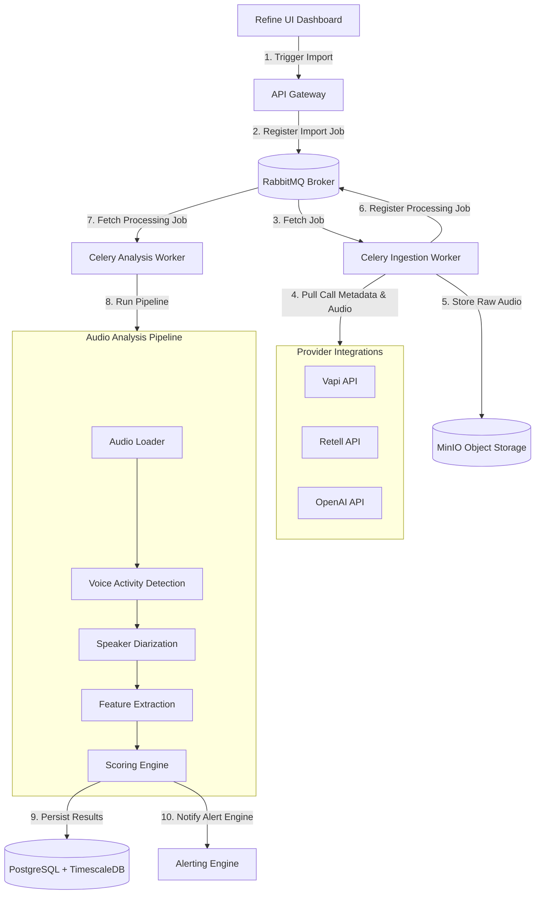

# Architecture Overview & System Design

This document details the system architecture of the **Benten Audio Evaluation Framework**, a system designed to ingest, process, and evaluate call recordings from voice AI providers.

---

## 1. System Topology

Benten is designed around an asynchronous, batch-based import and analysis architecture. Instead of processing raw real-time audio streams, Benten pulls completed call recordings from external providers (e.g., Vapi, Retell, OpenAI Realtime, ElevenLabs) using specialized API connectors.



---

## 2. Component Directory

### A. Ingestion Registry (RabbitMQ & Celery)
*   **RabbitMQ:** Acts as the message broker, managing two primary queues:
    1.  `audio-ingestion`: Tasks dedicated to talking to provider APIs, downloading audio binaries, and syncing metadata.
    2.  `audio-analysis`: High-compute tasks executing the multi-step signal processing and machine learning pipelines.
*   **Celery:** Distributed task queue executor. Workers are horizontally scalable. Ingestion workers are I/O-bound, while Analysis workers are GPU/CPU-bound (often deployed on instances with GPU access for transcription and diarization models).

### B. Storage Layer (MinIO & PostgreSQL)
*   **MinIO:** S3-compatible object storage repository. It stores raw audio files (usually in `.wav` or `.mp3` format) organized by project and conversation IDs (e.g., `s3://benten-recordings/{project_id}/{conversation_id}.wav`).
*   **PostgreSQL + TimescaleDB:** The primary database backend. 
    *   **Entity Hierarchy & Ownership:**
        *   **Organization:** The top-level administrative unit (contains Billing, Members).
        *   **Project:** Belongs to an Organization. *All* functional entities (Agents, Conversations, Alert Rules, Integrations) belong strictly to a Project.
        *   **Conversation:** Belongs directly and exclusively to a Project. There are no direct foreign keys or references between a Conversation and an Organization.
    *   **TimescaleDB:** Houses time-series metrics (turn-by-turn latency, raw jitter/SNR measurements, and emotion timelines) to ensure high-performance analytics.

---

## 3. Audio Analysis Pipeline

The Analysis Pipeline processes the ingested audio sequentially to extract key performance metrics.

```
       Audio File (MinIO)
               │
               ▼
      [ 1. Audio Loader ]
               │ (Resample, Mono/Stereo Normalization)
               ▼
   [ 2. Voice Activity Detection ]
               │ (Detect speech timestamps vs. silence)
               ▼
     [ 3. Speaker Diarization ]
               │ (Label segments: User vs. Agent)
               ▼
     [ 4. Feature Extraction ]
               ├── Prosody (Pitch, Intensity, Rhythm)
               ├── Emotion (Sentiment, Emotional markers)
               ├── Voice Quality (SNR, Jitter, MOS)
               ├── Speaking Rate (Words Per Minute)
               └── Silence (Dead Air)
               │
               ▼
      [ 5. Scoring Engine ]
               │ (Synthesize final health score & detect issues)
               ▼
      [ 6. Save to Dashboard ]
```

### 1. Audio Loader
*   **Input:** Raw audio binary from MinIO.
*   **Operations:** 
    *   Decodes the audio file format (WAV, MP3, M4A, etc.) to raw PCM.
    *   Resamples audio to a uniform sample rate (typically **16kHz, 16-bit mono** or **dual-channel stereo** depending on whether the provider outputs split-channel audio).
    *   Applies loudness normalization (e.g., EBU R128) to prevent amplitude variations from skewing voice quality and activity detection.

### 2. Voice Activity Detection (VAD)
*   **Operations:** Uses high-accuracy VAD models (such as Silero VAD or WebRTC VAD) to segment the audio into frames and classify them as speech or non-speech.
*   **Output:** A list of absolute millisecond-level timeframes where speech is present.

### 3. Speaker Diarization
*   **Operations:** Identifies "who spoke when" across the timeline.
    *   If the source audio is *stereo* (channel 0 = user, channel 1 = agent), the speaker identities are mapped directly.
    *   If the source audio is *mono*, the engine utilizes a clustering-based speaker diarization model (e.g., PyAnnote.audio) to separate speaker embeddings and tag them as `User` or `Agent` (validated by comparing the initial greeting segment, which is always the agent).
*   **Output:** Labeled, overlapping segments: `[Start, End, SpeakerID (User/Agent)]`.

### 4. Feature Extraction
Once segments are mapped, five feature extraction engines process the signal:

| Feature Engine | Input Analyzed | Method & Metrics Extracted |
| :--- | :--- | :--- |
| **Prosody** | Labeled Audio Segments | Measures pitch variance (F0 fundamental frequency), intensity (energy in dB), and speech envelope to detect stress, tone stability, and conversational rhythm. |
| **Emotion** | Audio + Transcript | Run in two passes:<br>1. **Acoustic:** Analyzes tone, speech rate spikes, and spectral features to spot arousal/stress.<br>2. **Textual:** Passes the turn transcript to a sentiment transformer (e.g., RoBERTa-emotion) to classify state (e.g., *Neutral, Calm, Frustrated, Confused*). |
| **Voice Quality** | Raw Audio Signal | Measures SNR (Signal-to-Noise Ratio), jitter (short-term frequency variation), and packet loss symptoms to calculate an estimated **Mean Opinion Score (MOS)** (scale 1-5). |
| **Speaking Rate** | Labeled Segments + STT | Calculates speaking rate per turn:<br>$$\text{WPM} = \frac{\text{Word Count in Segment}}{\text{Segment Duration in Minutes}}$$ |
| **Silence** | Non-speech VAD segments | Measures periods of inactivity. Any silence period between turns or during a speaker's segment that exceeds **1.5 seconds** is cataloged as *Dead Air*. |

### 5. Scoring Engine
The scoring engine ingests the raw metrics and computes the final evaluation:
*   **Metric Weighting:**
    *   *Latency:* 30% weight. Gaps $> 1.5\text{s}$ reduce score.
    *   *Dead Air:* 25% weight. Ratios $> 8\%$ reduce score.
    *   *Interruptions:* 20% weight. Frequency of user barge-ins and agent overlaps.
    *   *Voice Quality (MOS):* 15% weight. Scores $< 3.8$ degrade health.
    *   *Emotion Stability:* 10% weight. Frustration tags lower the score.
*   **Issue Detection Rules:** Employs heuristics to output descriptive tags (e.g., "Agent talked over user 3 times", "Average latency exceeded 1.2s").

---

## 4. UI Dashboard Synchronization

After the Scoring Engine completes:
1.  **PostgreSQL Update:** Data is written to `conversations` (overall statistics) and `speech_segments` (transcript alignment and timeline details).
2.  **SSE/WebSocket Notification:** The backend publishes a `conversation_processed` message to a Redis Pub/Sub channel. The UI listens to this event to update the list, dashboard counters, and detail pages in real-time.

<!-- Activity: simulated update on 2026-03-24 -->
