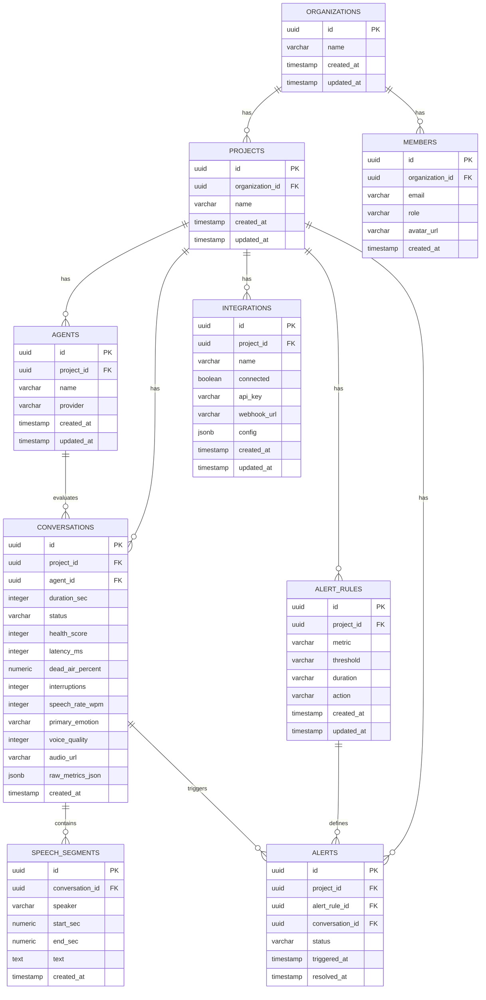

# Database Schema Design

This document details the database schema design for the **Benten Audio Evaluation Framework**. The schema is optimized for relational integrity, project-level multi-tenancy isolation, and fast query execution of analytics.

---

## 1. Entity Relationship Diagram (ERD)

The diagram below maps the relationships and strict ownership constraints in the system. 
*   **Organization** serves as the administrative domain containing Members and Projects.
*   **Project** is the primary ownership scope. All functional assets (Agents, Conversations, Integrations, Alert Rules, Alerts) belong directly to a **Project** (never directly to an Organization).



---

## 2. Table Definitions (DDL)

### organizations
```sql
CREATE TABLE organizations (
    id UUID PRIMARY KEY DEFAULT gen_random_uuid(),
    name VARCHAR(255) NOT NULL,
    created_at TIMESTAMP WITH TIME ZONE DEFAULT CURRENT_TIMESTAMP,
    updated_at TIMESTAMP WITH TIME ZONE DEFAULT CURRENT_TIMESTAMP
);
```

### projects
```sql
CREATE TABLE projects (
    id UUID PRIMARY KEY DEFAULT gen_random_uuid(),
    organization_id UUID NOT NULL REFERENCES organizations(id) ON DELETE CASCADE,
    name VARCHAR(255) NOT NULL,
    created_at TIMESTAMP WITH TIME ZONE DEFAULT CURRENT_TIMESTAMP,
    updated_at TIMESTAMP WITH TIME ZONE DEFAULT CURRENT_TIMESTAMP
);
```

### members
```sql
CREATE TABLE members (
    id UUID PRIMARY KEY DEFAULT gen_random_uuid(),
    organization_id UUID NOT NULL REFERENCES organizations(id) ON DELETE CASCADE,
    email VARCHAR(255) NOT NULL UNIQUE,
    role VARCHAR(50) NOT NULL, -- e.g., 'Owner', 'Developer', 'Viewer'
    avatar_url VARCHAR(2048),
    created_at TIMESTAMP WITH TIME ZONE DEFAULT CURRENT_TIMESTAMP
);
```

### agents
```sql
CREATE TABLE agents (
    id UUID PRIMARY KEY DEFAULT gen_random_uuid(),
    project_id UUID NOT NULL REFERENCES projects(id) ON DELETE CASCADE,
    name VARCHAR(255) NOT NULL,
    provider VARCHAR(50) NOT NULL, -- e.g., 'ElevenLabs', 'Vapi', 'Retell', 'OpenAI Realtime'
    created_at TIMESTAMP WITH TIME ZONE DEFAULT CURRENT_TIMESTAMP,
    updated_at TIMESTAMP WITH TIME ZONE DEFAULT CURRENT_TIMESTAMP
);
```Organization

↓

Project

↓

Conversation

Everything belongs to a Project.

Never directly to an Organization.

### conversations
```sql
CREATE TABLE conversations (
    id UUID PRIMARY KEY DEFAULT gen_random_uuid(),
    project_id UUID NOT NULL REFERENCES projects(id) ON DELETE CASCADE,
    agent_id UUID NOT NULL REFERENCES agents(id) ON DELETE CASCADE,
    duration_sec INTEGER NOT NULL DEFAULT 0,
    status VARCHAR(20) NOT NULL, -- 'Healthy', 'Warning', 'Critical'
    health_score INTEGER NOT NULL CHECK (health_score BETWEEN 0 AND 100),
    latency_ms INTEGER NOT NULL DEFAULT 0,
    dead_air_percent NUMERIC(5,2) NOT NULL DEFAULT 0.00,
    interruptions INTEGER NOT NULL DEFAULT 0,
    speech_rate_wpm INTEGER NOT NULL DEFAULT 0,
    primary_emotion VARCHAR(50), -- e.g., 'Calm', 'Frustrated'
    voice_quality INTEGER NOT NULL CHECK (voice_quality BETWEEN 0 AND 100),
    audio_url VARCHAR(2048),
    raw_metrics_json JSONB, -- Stores granular data (e.g. STT/TTS latency breakdown)
    created_at TIMESTAMP WITH TIME ZONE DEFAULT CURRENT_TIMESTAMP
);
```

### speech_segments
```sql
CREATE TABLE speech_segments (
    id UUID PRIMARY KEY DEFAULT gen_random_uuid(),
    conversation_id UUID NOT NULL REFERENCES conversations(id) ON DELETE CASCADE,
    speaker VARCHAR(10) NOT NULL CHECK (speaker IN ('user', 'agent')),
    start_sec NUMERIC(6,2) NOT NULL,
    end_sec NUMERIC(6,2) NOT NULL,
    text TEXT NOT NULL,
    created_at TIMESTAMP WITH TIME ZONE DEFAULT CURRENT_TIMESTAMP
);
```

### alert_rules
```sql
CREATE TABLE alert_rules (
    id UUID PRIMARY KEY DEFAULT gen_random_uuid(),
    project_id UUID NOT NULL REFERENCES projects(id) ON DELETE CASCADE,
    metric VARCHAR(50) NOT NULL, -- e.g., 'Dead Air', 'Average Latency'
    threshold VARCHAR(50) NOT NULL, -- e.g., '> 10%'
    duration VARCHAR(50) NOT NULL, -- e.g., '5 minutes', '1 conversation'
    action VARCHAR(100) NOT NULL, -- e.g., 'Send Slack & PagerDuty'
    created_at TIMESTAMP WITH TIME ZONE DEFAULT CURRENT_TIMESTAMP,
    updated_at TIMESTAMP WITH TIME ZONE DEFAULT CURRENT_TIMESTAMP
);
```

### alerts
```sql
CREATE TABLE alerts (
    id UUID PRIMARY KEY DEFAULT gen_random_uuid(),
    project_id UUID NOT NULL REFERENCES projects(id) ON DELETE CASCADE,
    alert_rule_id UUID NOT NULL REFERENCES alert_rules(id) ON DELETE CASCADE,
    conversation_id UUID REFERENCES conversations(id) ON DELETE SET NULL,
    status VARCHAR(20) NOT NULL, -- 'Triggered', 'Recovered'
    triggered_at TIMESTAMP WITH TIME ZONE DEFAULT CURRENT_TIMESTAMP,
    resolved_at TIMESTAMP WITH TIME ZONE
);
```

### integrations
```sql
CREATE TABLE integrations (
    id UUID PRIMARY KEY DEFAULT gen_random_uuid(),
    project_id UUID NOT NULL REFERENCES projects(id) ON DELETE CASCADE,
    name VARCHAR(50) NOT NULL, -- e.g., 'ElevenLabs', 'Vapi', 'Retell'
    connected BOOLEAN NOT NULL DEFAULT FALSE,
    api_key VARCHAR(500), -- Should be encrypted at-rest using crypto libraries
    webhook_url VARCHAR(2048),
    config JSONB, -- Custom credential fields specific to provider
    created_at TIMESTAMP WITH TIME ZONE DEFAULT CURRENT_TIMESTAMP,
    updated_at TIMESTAMP WITH TIME ZONE DEFAULT CURRENT_TIMESTAMP
);
```

---

## 3. Query Optimization & Indexing Strategy

To support fast performance on dashboard reads (sorting conversations by score, filtering by latency or date ranges, and searching by agent), we recommend the following indices:

### Relational Lookups & Foreign Keys
```sql
-- Fast index lookup for organization's projects
CREATE INDEX idx_projects_organization ON projects(organization_id);

-- Fast lookup for project-scoped entities
CREATE INDEX idx_agents_project ON agents(project_id);
CREATE INDEX idx_integrations_project ON integrations(project_id);
CREATE INDEX idx_alert_rules_project ON alert_rules(project_id);
CREATE INDEX idx_alerts_project ON alerts(project_id);
```

### Analytical Indexing on Conversations
```sql
-- Project-level compound index for listing conversations with date filters
CREATE INDEX idx_conversations_project_date ON conversations(project_id, created_at DESC);

-- Compound index to enable filtering conversations by agent, date, and score
CREATE INDEX idx_conversations_agent_score ON conversations(agent_id, score, created_at DESC);

-- Gin index on raw metrics for ad-hoc JSON querying
CREATE INDEX idx_conversations_raw_metrics ON conversations USING gin (raw_metrics_json);
```

### Transcript Lookup
```sql
-- Timeline search and playback alignment for speech segments
CREATE INDEX idx_speech_segments_conversation ON speech_segments(conversation_id, start_sec ASC);
```
